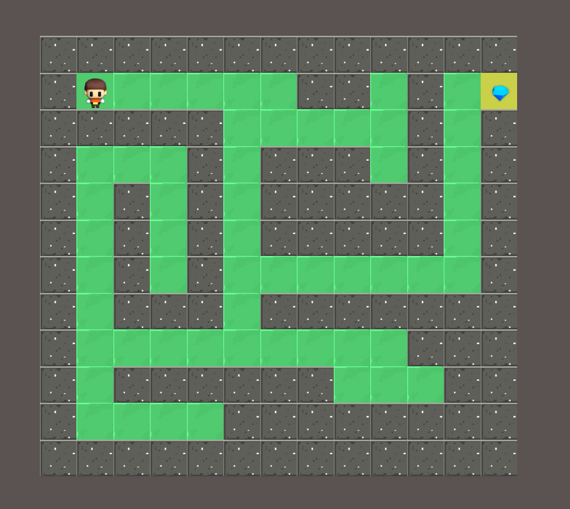

# Amezeing

Welcome to the [Amezeing](https://amezeing.netlify.app/) project repository.

 This is a simple, yet engaging, maze game implemented using JavaScript, HTML, and CSS. The game contains multiple levels, with each level featuring a different maze configuration.

## Overview
The game starts with the player at the 'Start' position. The player's goal is to navigate through the maze, avoid walls, and reach the 'Treasure' position. The game is won when the player has completed all levels (10 in total for now).

## Instructions
To play the game, use the arrow keys (up, down, left, right) to move the player around the maze. The player can only move into 'path' spaces and cannot go through 'wall' spaces. If the player reaches the 'Treasure', they progress to the next level. If the player completes all levels, they win the game.

## [TO PLAY CLICK HERE](https://amezeing.netlify.app/)

Preview:

